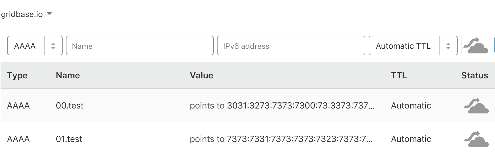

# Beacon
Beacon is the best way to store public ~persistent~ key-value data 
in the Open Internet. Data saved to Beacon is redundantly stored in
[`BitTorrent Tracker`](https://en.wikipedia.org/wiki/BitTorrent_tracker),
[`ED2K`](https://en.wikipedia.org/wiki/EDonkey_network),
[`Kad`](https://en.wikipedia.org/wiki/Kad_network),
and [`IPv6 DNS`](https://en.wikipedia.org/wiki/IPv6_address)(readonly, need to set manually).

## Current

#### Ready:
- [`IPv6 DNS`](https://en.wikipedia.org/wiki/IPv6_address) [Reader & Generator](#ipv6)

#### Todo:
- [`BitTorrent Tracker`](https://en.wikipedia.org/wiki/BitTorrent_tracker)
- [`ED2K`](https://en.wikipedia.org/wiki/EDonkey_network)
- [`Kad`](https://en.wikipedia.org/wiki/Kad_network)

### Install

```go
go get -u github.com/CovenantSQL/beacon
```

### IPv6

#### Generate AAAA Records
```bash
$ echo "012ssss\0\0s3ssssssss1sssss#ssssss" | beacon -trim -mode ipv6 -domain test.gridbase.io                 
Generated IPv6 addr:
;; AAAA Records:
00.test.gridbase.io	1	IN	AAAA	3031:3273:7373:7300:73:3373:7373:7373
01.test.gridbase.io	1	IN	AAAA	7373:7331:7373:7373:7323:7373:7373:7373
```

#### Set in your DNS Vendor



#### Read from DNS
Raw:
```bash
$ beacon -mode ipv6 -domain test.gridbase.io
INFO[0000] #### test.gridbase.io ####                   
012sssss3ssssssss1sssss#ssssss
INFO[0000] #### test.gridbase.io ####         
```
Hex:
```bash       
$ beacon -mode ipv6 -domain test.gridbase.io -hex
INFO[0000] #### test.gridbase.io ####                   
3031327373737300007333737373737373737331737373737323737373737373
INFO[0000] #### test.gridbase.io ####                   
```